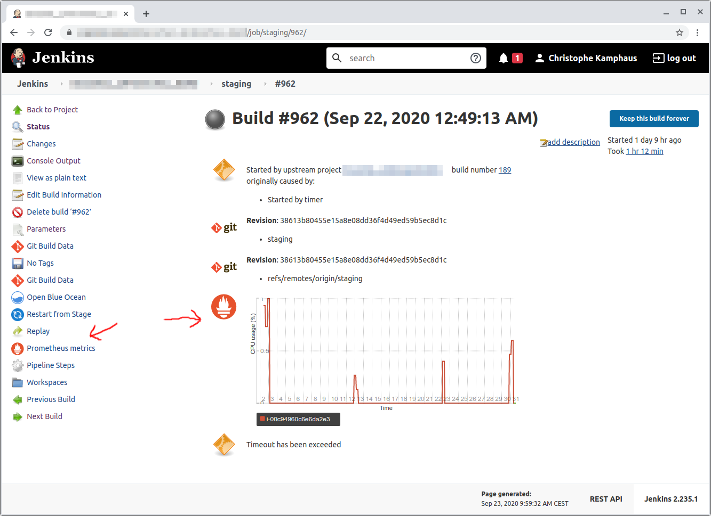
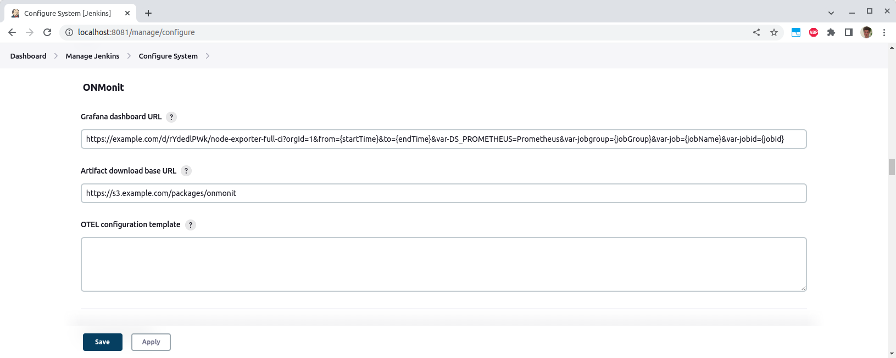

Prometheus monitoring of agents
-------------------------------

This plugin integrates with Prometheus time-series DB for monitoring of jobs.

It does this by deploying the prometheus node exporter on job agents.

--The plugin automatically detects whether an agent is already running, in which case the job label is only added to the existing prometheus exporter.--

A Prometheus server must be configured such as to scrape the exported metrics. This can be done in a way that Prometheus dynamically detects new agents, e.g. by annotating EC2 instances that are launched by Jenkin's [EC2 plugin](https://plugins.jenkins.io/ec2/).

The captured metrics are then displayed on the job page.

Usage
=====

## Building the plugin:

1. Clone the GitHub repository.
2. Import the Maven project into your favorite IDE (IntelliJ, Eclipse, etc.).
3. Build the plugin using the gradle script (`./gradlew build` or `gradlew.bat build` on Windows).
4. The plugin is created at `build/libs/prometheus-monitoring.hpi`.

## Installing the plugin:

### Installation from the Jenkins plugin repository

(The plugin is not yet published to the Jenkins repository)

This is the preferred way to install this plugin, since it ensures that the plugin releases have passed the Jenkins build pipeline and tests. This also provides an easy way to upgrade the plugin.

1. Log into your Jenkins web UI.
2. On the left-hand side of the screen, click “Manage Jenkins”.
3. Click “Manage Plugins”.
4. Near the top of the screen, click on the “Advanced” tab.
5. Search for “Prometheus monitoring”
6. Select “Prometheus monitoring”
7. Click “Download now and install after restart”
8. Restart Jenkins.

### Manual install:

1. Copy the `hpi` file to your Jenkins build server and place it in the Jenkins plugin directory (usually `/var/lib/jenkins/plugins`).
2. Ensure that the plugin is owned by the `jenkins` user.
3. Restart Jenkins.

### Web UI install:

1. Log into your Jenkins web UI.
2. On the left-hand side of the screen, click “Manage Jenkins”.
3. Click “Manage Plugins”.
4. Near the top of the screen, click on the “Advanced” tab.
5. Under the “Upload Plugin”, click “Choose File” and select the Prometheus monitoring plugin that you previously downloaded.
6. Click “Upload”.
7. Check the “Restart Jenkins when installation is complete and no jobs are running” checkbox.
8. Wait for Jenkins to restart.

## First-time configuration instructions:

1. Log into your Jenkins web UI.
2. On the left-hand side of the screen, click “Manage Jenkins”
3. Click “Configure System”.
4. Scroll down to the “Prometheus monitoring” header.
5. Enter the URL of the prometheus server which will scrape the agent metrics.
6. Click “Save”.

## Using the plugin in Jenkins job:

1. Log into your Jenkins web UI.
2. Click on the job you wish to edit.
3. On the left-hand side of the screen, click “Configure”.
4. Scroll down to the “Post-build Actions” header.
5. Click “Add post-build action” and select “Monitor agent with Prometheus”.
6.  Click “Save”.

## Using the plugin in Jenkins Pipeline

1. Go to Job > Pipeline Syntax > Snippet Generator
2. Select "prometheusmonit" sample step or "step: General Build Step" > "Monitor agent with Prometheus"
3. Click "Generate Pipeline Script"

## Configuration of Prometheus

