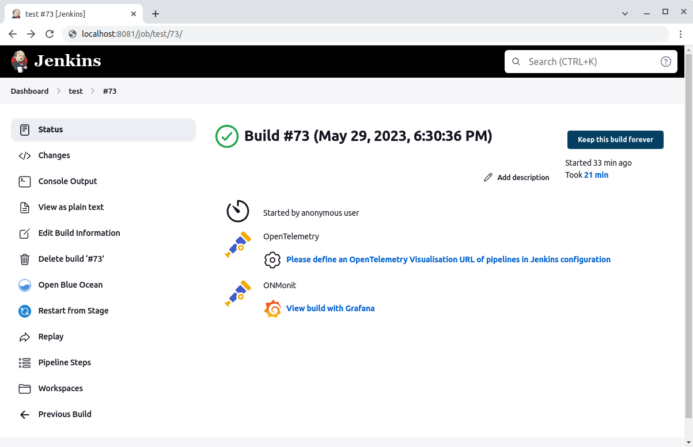
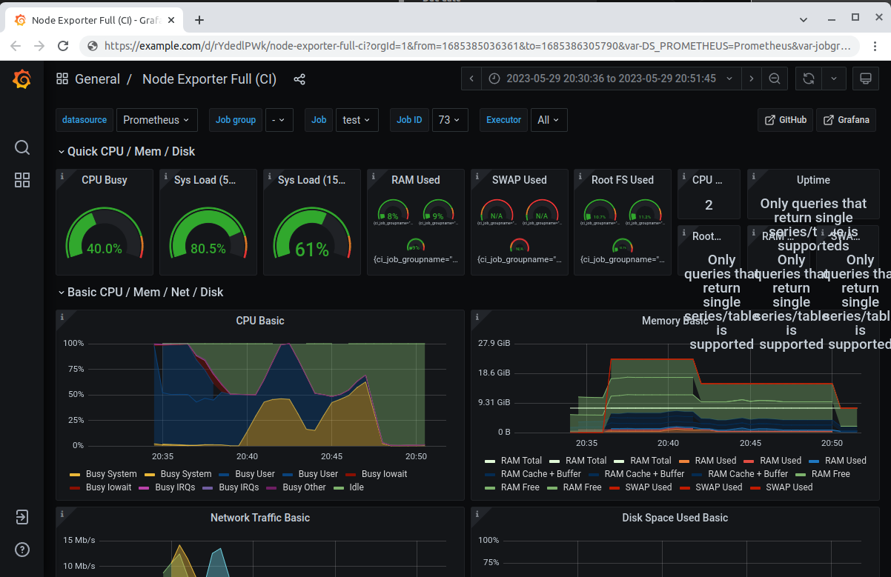

Otel + Node exporter monitoring of agents
-------------------------------

This plugin integrates with the Opentelemetry Collector and Node exporter for monitoring of build agents.

It does this by deploying the Prometheus node exporter and Opentelemetry (Otel) Collector on job agents.
The Otel Collector will scrape the metrics from node exporter.

On the job page a link will be displayed to a Grafana dashboard displaying the metrics of any build agents for a given build.






Usage
=====

## Building the plugin

1. Clone the GitHub repository.
2. Import the Maven project into your favorite IDE (IntelliJ, Eclipse, etc.).
3. Build the plugin using the maven wrapper script (`./mvnw clean package verify`).
4. The plugin is created at `target/opentelemetry-agent-metrics.hpi`.

## Installing the plugin

### Manual install

1. Copy the `hpi` file to your Jenkins build server and place it in the Jenkins plugin directory (usually `/var/lib/jenkins/plugins`).
2. Ensure that the plugin is owned by the `jenkins` user.
3. Restart Jenkins.

### Web UI install

1. Log into your Jenkins web UI.
2. On the left-hand side of the screen, click “Manage Jenkins”.
3. Click “Manage Plugins”.
4. Near the top of the screen, click on the “Advanced” tab.
5. Under the “Upload Plugin”, click “Choose File” and select the Otel monitoring plugin that you previously downloaded.
6. Click “Upload”.
7. Check the “Restart Jenkins when installation is complete and no jobs are running” checkbox.
8. Wait for Jenkins to restart.

### Offline installation

Follow https://www.jenkins.io/doc/book/installing/offline/ on how to install this plugin in an offline Jenkins instance.

## First-time configuration instructions

1. Log into your Jenkins web UI.
2. On the left-hand side of the screen, click “Manage Jenkins”
3. Click “Configure System”.
4. Scroll down to the “ONMonit” header.
5. Enter the URL of the Grafana dashboard which will display the agent metrics.
6. Optionally enter a URL from which the executables can be downloaded to the agents.
   cf [Setup the executable source](#Setup-the-executable-source)
7. Click “Save”.

### Configuration of OpenTelemetry destination

The onMonit step requires the `OTEL_EXPORTER_OTLP_ENDPOINT` environment variable to be available when it's executed.
This variable specifies the target to which agent metrics are sent in the otlp grpc protocol.

While this env var may be specified manually, the easiest way is to use the [opentelemetry-plugin](https://github.com/jenkinsci/opentelemetry-plugin/):
configure the _OTLP Endpoint_ setting and enable the _Export OpenTelemetry configuration as environment variables_ setting.

Optionally the Authentication header may be configured and passed to onMonit via the `OTEL_EXPORTER_OTLP_HEADERS` environment variable (also configurable in the opentelemetry-plugin).

### Setup the executable source

In order for this plugin to work 2 executables are run on the agents.

These executables can either be:
* present on the PATH of the agents
* downloaded from a URL on the agents. For this the global plugin option "**Artifact download base URL**" must be configured.
* uploaded from the Jenkins master. For this the executables must be manually stored under the JENKINS_HOME directory in the
  `opentelemetry-agent-metrics` subdirectory.

It's not necessary to have executables for all OSs and architectures, only those required for your CI agents.

These executables are available for download on
* https://github.com/open-telemetry/opentelemetry-collector-releases/releases
* https://github.com/prometheus/node_exporter/releases
* https://github.com/prometheus-community/windows_exporter/releases

Be sure to use the exact versions required by this plugin!

#### Example

When running build agents on Linux amd64 and Mac Os arm64, then either

* install on the `PATH` of any mac agents: `otelcol-contrib` (from `otelcol-contrib_0.135.0_darwin_arm64`) and `node_exporter` (from `node_exporter-1.9.1.darwin-arm64`)
  and on the `PATH` of any Linux agents: `otelcol-contrib` (from `otelcol-contrib_0.135.0_linux_amd64`) and `node_exporter` (from `node_exporter-1.9.1.linux-amd64`)

* setup a web server (or S3 bucket) serving:
  * https://example.com/base-url/node_exporter-1.9.1.darwin-arm64
  * https://example.com/base-url/node_exporter-1.9.1.linux-amd64
  * https://example.com/base-url/otelcol-contrib_0.135.0_darwin_arm64
  * https://example.com/base-url/otelcol-contrib_0.135.0_linux_amd64

  and configure `https://example.com/base-url` as the base URL in the plugin option.

* Save the executables under the JENKINS_HOME:
  * `$JENKINS_HOME/opentelemetry-agent-metrics/node_exporter-1.9.1.darwin-arm64`
  * `$JENKINS_HOME/opentelemetry-agent-metrics/node_exporter-1.9.1.linux-amd64`
  * `$JENKINS_HOME/opentelemetry-agent-metrics/otelcol-contrib_0.135.0_darwin_arm64`
  * `$JENKINS_HOME/opentelemetry-agent-metrics/otelcol-contrib_0.135.0_linux_amd64`

### (Optional) Using insecure http protocol

When used inside a trusted network the insecure http protocol may be used to transmit the agent metrics.

**Warning:** do not use this when sending the telemetry over the internet as it may expose sensitive data.

By default, the opentelemetry-collector prevents use of insecure connections.
This does not impact the success of builds using onMonit. It's just that no telemetry will be sent.
When using the `debug: true`, a log message like the following could be included in the build logs:
`info	exporterhelper/queued_retry.go:426	Exporting failed. Will retry the request after interval.	{"kind": "exporter", "data_type": "metrics", "name": "otlp", "error": "rpc error: code = Unavailable desc = connection error: desc = \"transport: authentication handshake failed: tls: first record does not look like a TLS handshake\"", "interval": "5.84280802s"}`

To override the default opentelemetry-collector behavior and allow insecure connections either use
the following argument in the onMonit step `ocAdditionalOptions: "--set=exporters.otlp.tls.insecure=true"`
or set the global setting **Otel-contrib default additional options** to `--set=exporters.otlp.tls.insecure=true`.

## Using the plugin in Jenkins Pipeline

1. Go to Job > Pipeline Syntax > Snippet Generator
2. Select "onMonit" sample step.
3. Click "Generate Pipeline Script"

When used in a pipeline involving multiple agents (eg. parallel stages), then `onMonit` needs to be explicitly
used for each stage running on a different node!

## Using the plugin in declarative Jenkins Pipeline

1. Go to Job > Pipeline Syntax > Declarative Directive Generator
2. Select "options" sample directive.
3. Add "onMonit".
4. Click "Generate Declarative Directive"

When used in a pipeline involving multiple agents (eg. parallel stages), then `onMonit` needs to be explicitly
used for each stage running on a different node!

## Using the plugin in Jenkins job

Currently, it's only possible to use this plugin in Pipeline jobs and not in freestyle jobs.

## Configuration of Grafana

The dashboard to which this plugin links should be able to display the metrics gathered from the agents.<br>
[Node Exporter Full](https://grafana.com/grafana/dashboards/1860-node-exporter-full/) was used as a basis to develop [node-exporter-full-ci.json](node-exporter-full-ci.json).
You can use this dashboard by importing the JSON file defining the dashboard linked above.

This dashboard additionally allows selecting by jobGroup, jobName, jobId and worker.

* The jobGroup variable is useful for multi-branch pipeline jobs to narrow the selection of jobNames to only
those of the selected multibranch pipeline.
* The jobName corresponds to the Jenkins job name
* The jobId is the job ID as assigned by Jenkins to each build
* The workerId allows to select which agent of a build the metrics were gathered on.
  This is useful for builds involving multiple agents (eg. using parallel stages).
  The `onMonit` step needs to be explicitly used for each stage running on a different node.

## Agents running on K8s

With `onMonit` it's possible to monitor CPU and memory metrics of agents running on K8s provisioned by the [kubernetes-plugin](https://github.com/jenkinsci/kubernetes-plugin/).

Since the `node_exporter` and `otelcol-contrib` processes cannot accurately monitor pod metrics from inside the container
we require that pod metrics are gathered independently of the `opentelemetry-agent-metrics-plugin`
(ie. by scraping the metrics endpoint of the k8s api and using kube-state-metrics).
Launching `node_exporter` and `otelcol-contrib` processes must be disabled in the `onMonit` step by using the parameter
`launchCollector: false`.

The [ci-pod-metrics-dashboard.json](ci-pod-metrics-dashboard.json) dashboard allows filtering for the pods used as agents
by filtering on a `cicd_pipeline_run_info` metric produced on the basis of the spans emitted by the [opentelemetry-plugin](https://github.com/jenkinsci/opentelemetry-plugin/)
using an opentelemetry-collector pipeline (eg. using the [collector.yaml](collector.yaml) config).

The dashboard json can be imported into Grafana and then the dashboard URL configured either in the global Jenkins onMonit config
or by using the following attributes in the onMonit step:

* `dashboardUrl: https://.../path/to/your/dashboard?var-jobgroup={jobGroup}&var-job={jobName}&var-jobid={jobId}&from={startTime}&to={endTime}`

Complete step example:
```
onMonit(
  launchCollector: false,
  dashboardUrl: 'https://.../path/to/your/dashboard?var-jobgroup={jobGroup}&var-job={jobName}&var-jobid={jobId}&from={startTime}&to={endTime}'
)
```

## Hardware requirements

The monitoring processes usually use 2MB in memory and 200 MB in disk size.
CPU usage is minimal.
