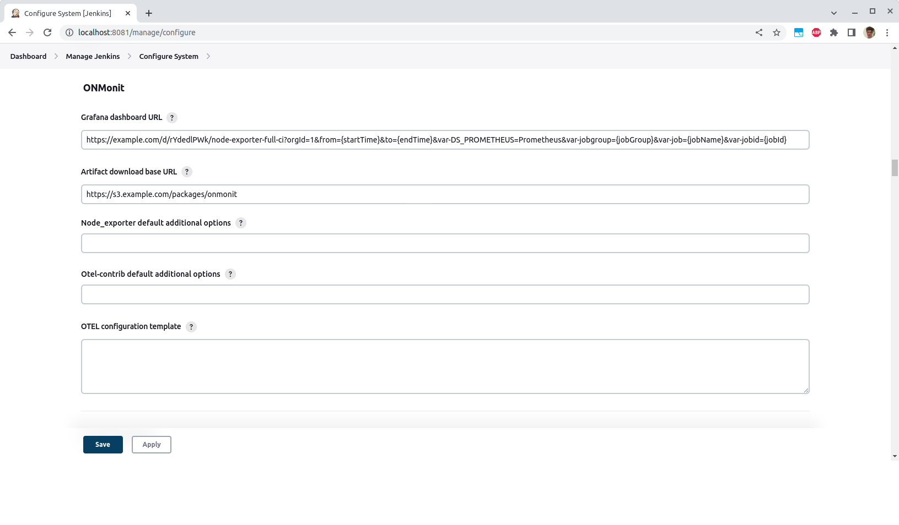

Otel + Node exporter monitoring of agents
-------------------------------

This plugin integrates with the Opentelemetry Collector and Node exporter for monitoring of build agents.

It does this by deploying the Prometheus node exporter and Opentelemetry (Otel) Collector on job agents.
The Otel Collector will scrape the metrics from node exporter.

On the job page a link will be displayed to a Grafana dashboard displaying the metrics of any build agents for a given build.

Usage
=====

## Building the plugin:

1. Clone the GitHub repository.
2. Import the Maven project into your favorite IDE (IntelliJ, Eclipse, etc.).
3. Build the plugin using the gradle script (`./gradlew build` or `gradlew.bat build` on Windows).
4. The plugin is created at `build/libs/otel-monitoring.hpi`.

## Installing the plugin:

### Manual install:

1. Copy the `hpi` file to your Jenkins build server and place it in the Jenkins plugin directory (usually `/var/lib/jenkins/plugins`).
2. Ensure that the plugin is owned by the `jenkins` user.
3. Restart Jenkins.

### Web UI install:

1. Log into your Jenkins web UI.
2. On the left-hand side of the screen, click “Manage Jenkins”.
3. Click “Manage Plugins”.
4. Near the top of the screen, click on the “Advanced” tab.
5. Under the “Upload Plugin”, click “Choose File” and select the Otel monitoring plugin that you previously downloaded.
6. Click “Upload”.
7. Check the “Restart Jenkins when installation is complete and no jobs are running” checkbox.
8. Wait for Jenkins to restart.

## First-time configuration instructions:

1. Log into your Jenkins web UI.
2. On the left-hand side of the screen, click “Manage Jenkins”
3. Click “Configure System”.
4. Scroll down to the “Otel monitoring” header.
5. Enter the URL of the Grafana dashboard which will display the agent metrics.
6. Click “Save”.

## Using the plugin in Jenkins job:

1. Log into your Jenkins web UI.
2. Click on the job you wish to edit.
3. On the left-hand side of the screen, click “Configure”.
4. Scroll down to the “Post-build Actions” header.
5. Click “Add post-build action” and select “Monitor agent with Otel.
6.  Click “Save”.

## Using the plugin in Jenkins Pipeline

1. Go to Job > Pipeline Syntax > Snippet Generator
2. Select "onmonit" sample step or "step: General Build Step" > "Monitor agent with Otel"
3. Click "Generate Pipeline Script"

## Configuration of Grafana

